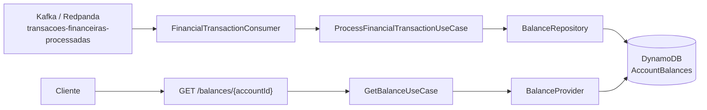

# Desafio tecnico Itau Unibanco - Consulta de saldo

API de consulta de saldo desenvolvida em Kotlin para o desafio tecnico Itau Unibanco. A aplicacao consome eventos financeiros do Kafka/Redpanda, persiste o saldo mais recente por conta no DynamoDB e expoe um endpoint REST para consulta.

## Stack

| Categoria | Tecnologia |
|-|-|
| Linguagem | Kotlin 2.3.21 |
| Runtime | Java 21 |
| Framework | Spring Boot 4.1.0 |
| Mensageria | Spring Kafka + Redpanda |
| Banco | DynamoDB Local / AWS SDK v2 |
| Testes | JUnit 5, Mockito, MockMvc, Konsist, JaCoCo |
| Infra local | Docker Compose |

## Arquitetura

O projeto segue arquitetura hexagonal, preservando a direcao das dependencias:

```text
adapter -> port -> application -> domain
```

Principais pacotes:

```text
src/main/kotlin/br/com/itau/challenge/
+-- Application.kt
+-- balance/
    +-- domain/          # modelos e regras de negocio
    +-- port/            # contratos de entrada e saida
    +-- application/     # casos de uso
    +-- adapter/
        +-- input/kafka  # consumidor Kafka
        +-- input/web    # API REST
        +-- output/dynamodb
```

O teste `HexagonalArchitectureTest` valida automaticamente que o dominio nao depende de frameworks e que as camadas respeitam a direcao esperada.

## Fluxo



## Regras de negocio

A aplicacao considera o evento recebido como um snapshot do saldo atual da conta. O valor nao e recalculado a partir de debitos/creditos, porque o payload do desafio ja traz `account.balance`.

Eventos sao aplicados apenas quando:

- `transaction.status == APPROVED`
- `account.status == ENABLED`
- `transaction.timestamp > 0`
- `transaction.amount > 0`
- `account.balance.currency` esta no formato ISO 4217, como `BRL`

Eventos rejeitados, recusados, invalidos ou de contas desabilitadas sao ignorados e registrados em log.

## Consistencia e idempotencia

O DynamoDB possui uma tabela `AccountBalances` com um item por conta.

| Atributo | Tipo | Descricao |
|-|-|-|
| `id` | String | Partition key com o UUID da conta |
| `owner` | String | UUID do titular |
| `balanceAmount` | Number | Saldo atual |
| `balanceCurrency` | String | Moeda ISO 4217 |
| `updatedAtMicros` | Number | Timestamp da transacao em microssegundos |
| `lastTransactionId` | String | Ultima transacao aplicada |

A escrita usa `UpdateItem` com condicao:

```text
attribute_not_exists(id)
OR updatedAtMicros < :incomingTimestamp
OR lastTransactionId = :incomingTransactionId
```

Com isso:

- duas atualizacoes concorrentes para a mesma conta sao resolvidas pelo DynamoDB;
- eventos mais antigos nao sobrescrevem o saldo mais recente;
- uma mesma transacao pode ser reprocessada sem quebrar a consistencia;
- mesmo timestamp com transacao diferente nao substitui o saldo armazenado.

Para deduplicacao historica completa, uma evolucao natural seria adicionar uma tabela/ledger de transacoes processadas. Para este escopo, a ordem por timestamp e o snapshot mais recente atendem ao contrato principal.

## API REST

### `GET /balances/{accountId}`

| Parametro | Local | Tipo | Descricao |
|-|-|-|-|
| `accountId` | Path | UUID | Identificador da conta |

Resposta `200 OK`:

```json
{
  "id": "5b19c8b6-0cc4-4c72-a989-0c2ee15fa975",
  "owner": "315e3cfe-f4af-4cd2-b298-a449e614349a",
  "balance": {
    "amount": 183.12,
    "currency": "BRL"
  },
  "updated_at": "2025-07-05T18:04:13.433-03:00"
}
```

Possiveis respostas:

| Status | Cenario |
|-|-|
| `200` | Conta encontrada |
| `400` | `accountId` nao e UUID valido |
| `404` | Conta nao encontrada |
| `503` | Falha ao acessar DynamoDB |

Exemplo:

```bash
curl http://localhost:8080/balances/5b19c8b6-0cc4-4c72-a989-0c2ee15fa975
```

## Kafka

Topico consumido:

```text
transacoes-financeiras-processadas
```

Payload esperado:

```json
{
  "transaction": {
    "id": "8e8ae808-b154-48b5-9f3e-553935cc4543",
    "type": "CREDIT",
    "amount": 97.07,
    "currency": "BRL",
    "status": "APPROVED",
    "timestamp": 1751749453433000
  },
  "account": {
    "id": "5b19c8b6-0cc4-4c72-a989-0c2ee15fa975",
    "owner": "315e3cfe-f4af-4cd2-b298-a449e614349a",
    "created_at": 1634874339000000,
    "status": "ENABLED",
    "balance": {
      "amount": 183.12,
      "currency": "BRL"
    }
  }
}
```

Criar o topico manualmente:

```bash
make kafka-topic-create NAME=transacoes-financeiras-processadas PARTITIONS=3
```

Gerar eventos aleatorios:

```bash
make kafka-produce-transactions-events TOPIC=transacoes-financeiras-processadas COUNT=50
```

## Como rodar

Pre-requisito: Docker com Docker Compose.

```bash
make up
make logs
```

Consoles locais:

| Console | URL |
|-|-|
| API | http://localhost:8080 |
| DynamoDB Admin | http://localhost:8001 |
| Redpanda Console | http://localhost:8081 |

Testar manualmente depois do `make up`:

```bash
curl http://localhost:8080/balances/5b19c8b6-0cc4-4c72-a989-0c2ee15fa975
make db-scan
```

Parar a stack:

```bash
make stop
```

## Testes

Rodar testes unitarios, arquitetura e cobertura:

```bash
./gradlew check
```

Ou via Docker:

```bash
make test
```

Rodar testes de integracao contra infraestrutura local:

```bash
make integration-test
```

A cobertura minima configurada e de 90% de instrucoes.

## Resiliencia e operacao

Implementado neste escopo:

- validacao e descarte controlado de mensagens invalidas;
- escrita condicional no DynamoDB para concorrencia e eventos fora de ordem;
- tratamento de falhas do DynamoDB no endpoint REST com `503`;
- logs estruturados nos fluxos de ingestao;
- testes para fluxo principal, duplicidade, mensagens antigas, contrato REST e arquitetura.

Evolucoes recomendadas para producao:

- DLQ ou retry topic para mensagens invalidas/transientes;
- schema registry ou validacao contratual do payload;
- metricas de eventos consumidos, ignorados, atualizados e falhas por dependencia;
- tracing distribuido entre Kafka, aplicacao e DynamoDB;
- alarmes para lag do consumidor, erro de escrita e latencia do endpoint;
- circuit breaker/timeouts configurados de acordo com SLOs;
- autoscaling baseado em lag e latencia.
